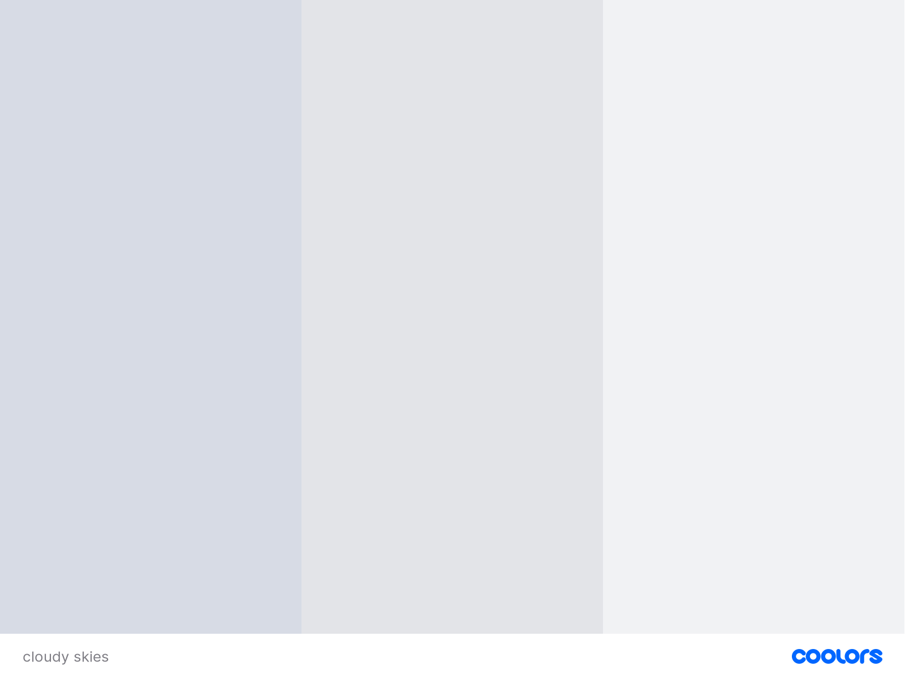
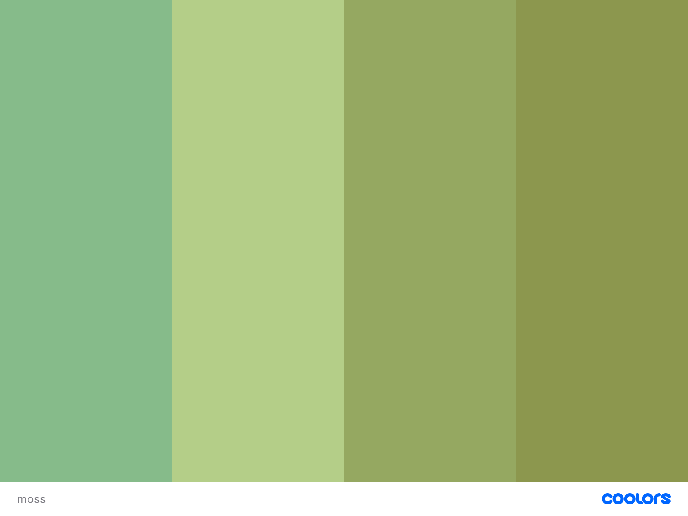
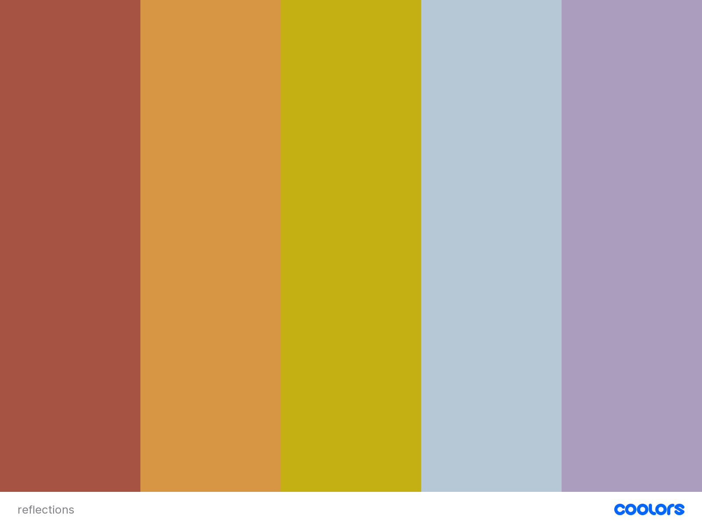
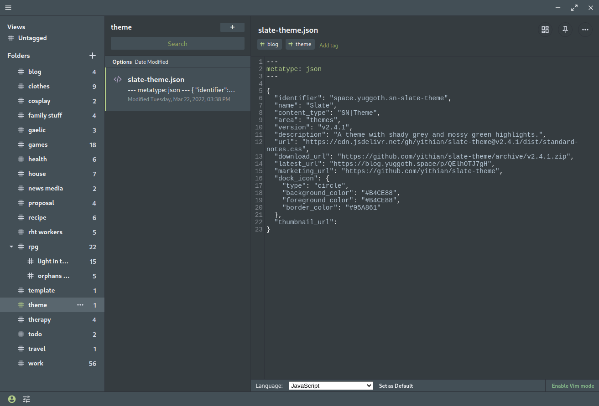
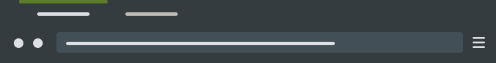

## Slate Theme

A theme with shady grey and mossy green highlights.

## Palettes

## Screenshot

### Standard Notes

### Firefox

## Standard Notes Installation

1. Click on Extensions -> Import Extension
2. Paste https://blog.yuggoth.space/p/QElhOTJ7gH into the input box and press enter
3. Click Install
4. Activate Slate

## Firefox Installation

1. Browse to https://addons.mozilla.org/en-US/firefox/addon/slate-theme/
2. Click Install

## windows-terminal usage

1. Launch windows-terminal and open the settings (Ctrl+,)
2. Add [the theme](./dist/windows-terminal.json) to the "schemes" array
3. Add `"colorScheme": "slate"` to whichever profile you want to use the theme
