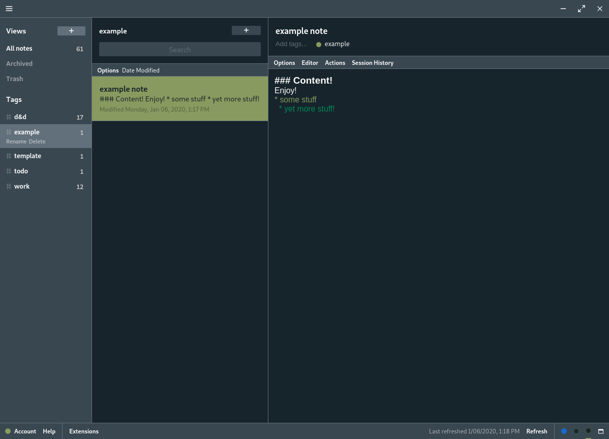

## Slate Theme

A Standard Notes theme with shady grey and mossy green highlights.

## Screenshot

## Installation

1. Click on Extensions -> Import Extension
2. paste https://blog.yuggoth.space/p/fvqXJWJqYi into the input box and press enter
3. click Install
4. Activate Slate
